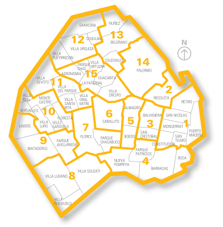

```{r setup, include=FALSE}
knitr::opts_chunk$set(echo = TRUE)
knitr::opts_chunk$set(echo = TRUE)
knitr::opts_chunk$set(message = FALSE)
knitr::opts_chunk$set(warning = FALSE)
library(dplyr)
library(tidyverse)
library(readxl)
library(moments)
library(ggplot2)

library(tidymodels)
library(plotly)
library(vip)
library(faraway)
```
# Carga de los datos

Se toma el dataset disponible en: https://www.kaggle.com/competitions/fcen-dm-2024-prediccin-precio-de-propiedades

De la base de datos, se toman los datos de entrenamiento.

A los registros se les aplicó los siguientes filtros:

l1 - Nivel administrativo 1: (Argentina).

l2 - Nivel administrativo 2: (Capital Federal).

property_type - Tipo de propiedad: (PH).

Operation_type - Tipo de operación: (Venta).

## Carga del archivo Excel

```{r lectura_datos}

dataset <- read_excel("datos_tp1.xlsx")
nrow(dataset)
```

## Selección de la muestra

Para la base de datos seleccionada se generó una muestra aleatoria de tamaño n = 500 utilizando como semilla los últimos tres dígitos del DNI (893).

```{r seleccion_muestra}

set.seed(893)
datos_orig <- dataset %>%
  sample_n(size=500,replace=FALSE)
```

# Preprocesamiento de los datos (tomado del TP1)

Se eligieron rangos razonables para las variables estudiadas, y se descartaron del análisis los datos que se encontraran por fuera.

Concretamente, se toman los datos en los cuales la latitud sea menor a -34 grados, y la superficie total sea menor a 5000 metros cuadrados. Con estos filtros, los puntos quedan contenidos dentro de una región geográfica que podría compararse con la circunscripta en los límites de la Ciudad Autónoma de Buenos Aires. (Aclaración: los valores de latitud y longitud se intercambian porque estaban intercambiados y mal asignados los nombres de las columnas en el dataset original.)

Luego se intercambiaron los valores de superficie total y superficie cubierta, cuando la cubierta era mayor que la total.
Se imputaron los valores faltantes de superficie con su contrapartida correspondiente, es decir, cuando faltaba la superficie total se imputó con la superficie cubierta y viceversa. Aquí cabe hacer la salvedad de que la superficie cubierta se imputó con la mediana de la proporción de la superficie cubierta sobre la total, multiplicada por la superficie total. Si se empleaba directamente la total, la aproximación resultaba demasiado grosera, puesto que resultaba en valores excesivamente altos de superficie cubierta.

Luego se imputó las habitaciones (bedrooms) con la cantidad de ambientes (rooms) menos uno. Se imputó los baños con el valor 1 en caso de que faltara el valor. Se realizan otras imputaciones a fin de completar los campos rooms, bedrooms y bathrooms en unos pocos registros.

Por último, se quitó la primera entrada de la muestra de datos por ser un "Edificio de departamentos tipo PH", y tratarse más bien de un conjunto de siete PHs, y por lo tanto no encajar estrictamente en la categoría propuesta para el análisis, y contrastar excesivamente con el resto de los datos de la muestra. El incluir esta entrada distorsionaba los resultados de los análisis.

Asimismo, se elimina un registro duplicado.

```{r graficos_cuantitativas}

datos <- datos_orig
datos <- distinct(datos)

#Swapeamos los datos de latitud y longitud.
datos$tmp <- datos$lon
datos$lon <- datos$lat
datos$lat <- datos$tmp
datos$tmp <- NULL

#datos_filtrados_geo <- datos[datos$lat <= -34, ]
datos_filtrados_geo <- datos %>% 
  filter(lat <= -34)

#datos_filtro_superficie <- datos_filtrados_geo[datos_filtrados_geo$surface_total <= 5000, ]
datos_filtro_superficie <- datos_filtrados_geo %>% 
  filter(surface_total <= 5000)

cubierta_supera_total <- !is.na(datos_filtro_superficie$surface_covered) & !is.na(datos_filtro_superficie$surface_total) & datos_filtro_superficie$surface_covered > datos_filtro_superficie$surface_total
datos_filtro_superficie[cubierta_supera_total, c("surface_covered", "surface_total")] <- datos_filtro_superficie[cubierta_supera_total, c("surface_total", "surface_covered")]


#Chequeamos que los outliers de precio sean datos verosímiles
datos_filtro_superficie[datos_filtro_superficie$price>=4e5, ]

#Más preprocesamiento de los datos:

sup_no_nula <- !is.na(datos_filtro_superficie$surface_total) & !is.na(datos_filtro_superficie$surface_covered) & (datos_filtro_superficie$surface_total != 0) & (datos_filtro_superficie$surface_covered != 0)
proporcion_sup_cubierta <- datos_filtro_superficie[sup_no_nula, "surface_covered"]/datos_filtro_superficie[sup_no_nula,  "surface_total"]

datos_filtro_superficie$surface_covered[is.na(datos_filtro_superficie$surface_covered)] <- datos_filtro_superficie$surface_total[is.na(datos_filtro_superficie$surface_covered)]*median(proporcion_sup_cubierta$surface_covered)

datos_filtro_superficie$surface_total[is.na(datos_filtro_superficie$surface_total)] <- datos_filtro_superficie$surface_covered[is.na(datos_filtro_superficie$surface_total)]


datos_filtro_superficie$bathrooms[is.na(datos_filtro_superficie$bathrooms)] <- 1
condicion = (is.na(datos_filtro_superficie$bedrooms)) & !is.na(datos_filtro_superficie$rooms) & (datos_filtro_superficie$rooms>1)
datos_filtro_superficie$bedrooms[condicion] <- datos_filtro_superficie$rooms[condicion] - 1

#null en cantidad de ambientes
rooms_nulo = is.na(datos_filtro_superficie$rooms) & !is.na(datos_filtro_superficie$bedrooms)
datos_filtro_superficie$rooms[rooms_nulo] <- datos_filtro_superficie$bedrooms[rooms_nulo] + 1

rooms_nulo_banio_no_nulo = is.na(datos_filtro_superficie$rooms) & !is.na(datos_filtro_superficie$bathrooms)
#monoambiente
rooms_nulo_banio_unico = rooms_nulo_banio_no_nulo & (datos_filtro_superficie$bathrooms == 1)
datos_filtro_superficie$rooms[rooms_nulo_banio_unico] <- 1
rooms_nulo_banio_unico_bedrooms_nulo = rooms_nulo_banio_unico & is.na(datos_filtro_superficie$bedrooms)
datos_filtro_superficie$bedrooms[rooms_nulo_banio_unico_bedrooms_nulo] <- 1

rooms_nulo_mas_de_un_banio = rooms_nulo_banio_no_nulo & (datos_filtro_superficie$bathrooms > 1)
datos_filtro_superficie$rooms[rooms_nulo_mas_de_un_banio] <- datos_filtro_superficie$bathrooms[rooms_nulo_mas_de_un_banio] + 1

#null en cantidad de habitaciones
bedrooms_nulo_banio_unico = !is.na(datos_filtro_superficie$rooms) & is.na(datos_filtro_superficie$bedrooms) & (datos_filtro_superficie$bathrooms == 1) & (datos_filtro_superficie$rooms == 1)
bedrooms_nulo_mas_de_un_banio = !is.na(datos_filtro_superficie$rooms) & is.na(datos_filtro_superficie$bedrooms) & (datos_filtro_superficie$bathrooms > 1) & (datos_filtro_superficie$rooms > 1)
#monoambiente
datos_filtro_superficie$bedrooms[bedrooms_nulo_banio_unico] <- 1
datos_filtro_superficie$bedrooms[bedrooms_nulo_mas_de_un_banio] <- datos_filtro_superficie$rooms[bedrooms_nulo_mas_de_un_banio] - 1


datos <- datos_filtro_superficie

#Sacamos la primera entrada de la base por ser un "Edificio de departamentos tipo PH" que es más bien un conjunto de 7 PHs
datos[1,]
datos <- datos[-1, ]

#se elimina un dato duplicado
datos[c(243,304),]
datos <-datos[-304, ]

```

# Generación de las variables comuna y zona

{#id .class width=50% height=50%}

En esta sección, primero imputamos algunos valores faltantes de barrios (l3), y luego generamos las variables comuna y zona, a partir de una tabla almacenada externamente que contiene las correspondencias entre barrios y comunas.

```{r comunas}
datos$l3[datos$id == 9989] <- "Villa Santa Rita"
datos$l3[datos$id == 49069] <- "Saavedra"
datos$l3[datos$id == 16402] <- "Palermo"
datos$l3[datos$id == 11748] <- "Versalles"

#El archivo barrios_base contiene el mapeo (asignación) de cada barrio a las comunas y las zonas
barrios_base <- read.csv('barrios_base.csv')
datos_comunas <- datos %>% left_join(barrios_base, by = c("l3" = "barrio"))
write.csv(datos_comunas, file = 'datos.csv', row.names = FALSE)

datos_comunas$comuna <- factor(datos_comunas$comuna)
datos <-datos_comunas
```

A continuación generamos una nueva variable: precio / m² a partir de registros bibliográficos.

Estas fueron algunas de las fuentes utilizadas:

https://tn.com.ar/general/2022/01/14/barrio-por-barrio-los-precios-del-metro-cuadrado-en-la-ciudad-de-buenos-aires/

https://mudafy.com.ar/d/valor-metro-cuadrado-en-caba-por-barrio#sec-mapa-m2


```{r barrios}
precios_barrios <- list(
  "Abasto" = 1576, "Agronomía" = 1712, "Almagro" = 1734, "Balvanera" = 1576,
  "Barracas" = 1523, "Barrio Norte" = 2447, "Belgrano" = 2224, "Boca" = 1232,
  "Boedo" = 1614, "Caballito" = 1903, "Catalinas" = 1500, "Centro / Microcentro" = 1533,
  "Chacarita" = 1756, "Coghlan" = 1880, "Colegiales" = 2017, "Congreso" = 1655,
  "Constitución" = 1321, "Distrito Audiovisual" = 3500, "Flores" = 1609,
  "Floresta" = 1572, "Las Cañitas" = 2669, "Liniers" = 1545, "Mataderos" = 1467,
  "Monserrat" = 1524, "Monte Castro" = 1658, "Núñez" = 2138, "Once" = 1576,
  "Palermo" = 2173, "Parque Avellaneda" = 1372, "Parque Centenario" = 1683,
  "Parque Chacabuco" = 1637, "Parque Chas" = 1724, "Parque Patricios" = 1430,
  "Paternal" = 1533, "Pompeya" = 1184, "Puerto Madero" = 4183, "Recoleta" = 2106,
  "Retiro" = 2000, "Saavedra" = 1986, "San Cristóbal" = 1547, "San Nicolás" = 1548,
  "San Telmo" = 1645, "Tribunales" = 1567, "Vélez Sarsfield" = 1480,"Versalles" = 1562,
  "Villa Crespo" = 1825, "Villa del Parque" = 1783, "Villa Devoto" = 1812,
  "Villa General Mitre" = 1550, "Villa Lugano" = 1124, "Villa Luro" = 1623,
  "Villa Ortuzar" = 1737, "Villa Pueyrredón" = 1803, "Villa Real" = 1675,
  "Villa Riachuelo" = 785, "Villa Santa Rita" = 1581, "Villa Soldati" = 930,
  "Villa Urquiza" = 2038, "Nuñez" = 2138, "San Cristobal" = 1547, "Velez Sarsfield" = 1480
)

datos$precio_m2_biblio <- precios_barrios[match(datos$l3, names(precios_barrios))]
datos$precio_m2_biblio <- as.numeric(datos$precio_m2_biblio)

```

Asimismo, generamos la variable superficie estándar, que tiene en cuenta los metros cubiertos, y le suma la mitad de los descubiertos, que es el valor que habitualmente le asignan las inmobiliarias, como se puede corroborar en la fuente siguiente:

https://www.lanacion.com.ar/propiedades/casas-y-departamentos/departamento-chico-terraza-grande-hasta-cuanto-pagar-por-los-m2-descubiertos-nid15092021/

Empleando esta variable calculamos el \(\frac{precio}{m^2} = \frac{precio}{superficie\_estandar}\).


```{r variables_auxiliares}
datos$superficie_estandar <- 0.5*(datos$surface_total - datos$surface_covered) + datos$surface_covered
datos$precio_m2 <- datos$price / datos$superficie_estandar
```


# Análisis exploratorio y descriptivo

Se realiza un análisis exploratorio y descriptivo (EDA) de cada una de las variables cuantitativas, según la comuna de C.A.B.A. Se presenta la información en la tabla a continuación, conteniendo las siguientes medidas descriptivas:

Cantidad de datos, mínimo, máximo, media, varianza y desviación estándar.

```{r funcion_resumen, include=FALSE}
resumen <- function(datos){

conteo <- function(x) {return(sum(!is.na(x)))}
#coefvar <- function(x) {return(sd(x,na.rm=TRUE)/mean(x,na.rm=TRUE))}
#mode <- function(x) {return(as.numeric(names(which.max(table(x)))))}
cantidad <- sapply(datos, conteo)
minimo <- sapply(datos, min, na.rm=TRUE)
maximo <- sapply(datos, max, na.rm=TRUE)
media <- sapply(datos, mean, na.rm=TRUE)
#mediana <- sapply(datos, median, na.rm=TRUE)
#moda <- sapply(datos, mode)
varianza <- sapply(datos, var, na.rm=TRUE)
desvio_estandar <- sapply(datos, sd, na.rm=TRUE)
#coef_variacion <- sapply(datos, coefvar)
#cuartil1 <- sapply(datos, quantile, 0.25, na.rm=TRUE)
#cuartil3 <- sapply(datos, quantile, 0.75, na.rm=TRUE)
#RIC <- sapply(datos, IQR, na.rm=TRUE)
#MAD <- sapply(datos, mad, na.rm=TRUE)
#asimetria <- sapply(datos, skewness, na.rm=TRUE)
#kurtosis <- sapply(datos, kurtosis, na.rm=TRUE)
#res <- as.data.frame(list(cantidad,minimo,maximo,media,mediana,moda,varianza,desvio_estandar,coef_variacion,cuartil1,cuartil3,RIC,MAD,asimetria,kurtosis))
#columnas <- c("Cantidad", "Mínimo", "Máximo", "Media", "Mediana", "Moda", "Varianza", "Desvío estándar", "Coef. de variación", "Cuartil 1", "Cuartil 3", "Rango intercuartílico", "MAD", "Asimetría", "Kurtosis")
res <- as.data.frame(list(cantidad,minimo,maximo,media,varianza,desvio_estandar))
columnas <- c("Cantidad", "Mínimo", "Máximo", "Media", "Varianza", "Desviación estándar")
colnames(res) <- columnas
return(res)}
```

```{r eda_cuantitativas}
library(kableExtra)
library(knitr)

vars_cuanti <- c("lat", "lon", "rooms", "bedrooms", "bathrooms", "surface_total", "surface_covered", "superficie_estandar","precio_m2", "precio_m2_biblio", "price")

resultados <- data.frame()
for (comuna_i in unique(barrios_base$comuna)) {
datos_filtro_comuna <- datos[datos$comuna == comuna_i,]
datos_cuanti <- datos_filtro_comuna[, vars_cuanti]
resumen_cuanti <- resumen(datos_cuanti)
resumen_cuanti$Variable <- rownames(resumen_cuanti)
rownames(resumen_cuanti) <- NULL
resumen_cuanti$Comuna <- comuna_i
resultados <- rbind(resultados, resumen_cuanti)
}

datos_cuanti <- datos[, vars_cuanti]

resultados <- resultados[, c('Comuna','Variable', 'Cantidad',	'Mínimo',	'Máximo',	'Media',	'Varianza', 'Desviación estándar')]

resultados |> knitr::kable(format = "html") |> 
  kable_styling()
```

# Diferencia de medias

A lo largo de este Trabajo Práctico se empleó un nivel de significación (\(\alpha\)) de 0.05.

En primer lugar realizamos boxplots del precio / m² para todas las comunas a fin de tener una primera impresión sobre la distribución de los datos, previo a realizar las pruebas estadísticas. En algunos casos, la elección de las comunas a analizar estuvo condicionada por el cumplimiento / incumplimiento de los supuestos. 

```{r diferencia_medias_pre}
library(car)
library(BSDA)

boxplot(precio_m2~comuna,data=datos,xlab="Comuna",ylab="Precio/m2",col="royalblue",border="darkblue")
```

## Intervalo de confianza

En esta sección nos proponemos estimar la diferencia de medias del precio/m² para las comunas 12 y 15. Para realizar la estimación del intervalo de confianza del 95% empleamos la totalidad de los datos en ambas comunas (n=55 y 68 respectivamente). Comparamos ambas comunas con un boxplot del precio/m².

En primer lugar, verificamos que se cumplan los supuestos de normalidad y homocedasticidad.

Para probar la normalidad realizamos la prueba de Shapiro-Wilk sobre ambos conjuntos de datos, y en ambos casos la prueba resulta no significativa, con lo cual se puede asumir como cierto el supuesto de normalidad. Esto se condice con los gráficos QQ-Plot, que si bien muestran algunos datos desviándose de la recta identidad, no parecen hacerlo siguiendo un patrón. Además, es importante señalar que, dado el n de las muestras, podemos asumir la normalidad del estimador (la media), por el teorema central del límite (no es necesario realizar la prueba de Shapiro-Wilk o analizar el QQ-Plot).

Para verificar la homogeneidad de varianzas empleamos el test de Levene, que también resulta no significativo, con lo cual podemos asumir que este supuesto se cumple.

Procedemos a calcular el intervalo de confianza empleando el estadístico t de Student (para muestras de dos poblaciones con varianza desconocida). El intervalo obtenido contiene al cero.

\(IC_{95\%} (C12 - C15) =  [-37.9, 308.5 ]\)

## Prueba de hipótesis

Planteamos las hipótesis de la prueba:

\(H_0: \mu_{12} - \mu_{15} = 0\)

\(H_1: \mu_{12} - \mu_{15} \neq 0\)


La misma salida del intervalo de confianza contiene el resultado de la prueba de hipótesis que resulta en un estadístico t igual a 1.55 con 121 grados de libertad, dando un p-valor igual a 0.13. Comparado con el \(\alpha\) de 0.05; al ser mayor, se concluye que la prueba es no significativa: es decir, no hay evidencia suficiente para concluir que la diferencia de medias observadas difiere significativamente de cero. Este resultado es congruente con el intervalo de confianza antes estimado, que contenía al cero, lo cual es lógico dado que se trata de una prueba a dos colas, por lo cual son formas equivalentes de estudiar la diferencia de medias.

Además de esta prueba, realizamos la prueba con el estadístico Z, que teóricamente debería ser más potente que la prueba de t Student, pero que implica conocer las varianzas poblacionales que, en este caso, asumimos iguales a las muestrales (puesto que no disponemos de un dato mejor, por ejemplo, de un dato bibliográfico). La prueba de todas formas resulta no significativa, con lo cual no cambia la conclusión respecto de la prueba anterior; esto es, no llegamos a detectar una diferencia significativa.

Cabe señalar que planteando la prueba a una cola, esta seguía siendo no significativa.

```{r diferencia_medias}
datos_comuna12 <- subset(datos, comuna ==12)$precio_m2
datos_comuna15 <- subset(datos, comuna ==15)$precio_m2

sd_comuna12<-sd(datos_comuna12)
sd_comuna15<-sd(datos_comuna15)

datos_comunas12_15 <- subset(datos, comuna ==12 | comuna ==15)
datos_comunas12_15$comuna <- as.numeric(datos_comunas12_15$comuna)
datos_comunas12_15$comuna <- factor(datos_comunas12_15$comuna)
boxplot(precio_m2~comuna,data=datos_comunas12_15,xlab="Comuna",ylab="Precio/m2",col="royalblue",border="darkblue")

shapiro.test(datos_comuna15)
shapiro.test(datos_comuna12)

qqPlot(datos_comuna15)
qqPlot(datos_comuna12)

leveneTest(precio_m2 ~ comuna, data = datos_comunas12_15)

t.test(datos_comuna12,datos_comuna15, var.equal=TRUE)

z.test(datos_comuna12,datos_comuna15, mu=0, alternative= "two.sided", sigma.x=sd_comuna12, sigma.y=sd_comuna15)
```
# Diferencia de medias (test no paramétrico)

En esta sección nos proponemos comparar las medias de precio/m² de las comunas 6 y 9. Cabe destacar que para ambas comunas n = 23 < 30, por lo cual no se puede aplicar el teorema central del límite.

En primer lugar, realizamos las pruebas de Shapiro-Wilk para testear la normalidad de los datos, y para ambas muestras, los test resultan significativos, es decir, que se rechaza el supuesto de normalidad en ambos casos. Esto se condice con el gráfico QQ-Plot, en el que los puntos parecen seguir un patrón, que se puede notar especialmente en el caso de los datos de la comuna 9.

No tiene sentido realizar la prueba de Levene, porque un supuesto ya no se cumple y con eso basta, y además, si bien dicha prueba tiene cierta robustez a la falta de normalidad, lo es a desviaciones ligeras.

En este contexto, no es posible realizar una prueba paramétrica, por el incumplimiento de sus supuestos, y procedemos a realizar la prueba de Mann-Whitney, que es no paramétrica y se basa en la comparación de rangos (ranks). Asimismo, las hipótesis de este test se formulan para las medianas. Llamamos:

\(\theta_6\) a la mediana poblacional (posición central) del precio/m² de la comuna 6

\(\theta_9\) a la mediana poblacional (posición central) del precio/m² de la comuna 9

Hipótesis subyacentes a la prueba:

\(H_0 : \theta_6 = \theta_9\)

\(H_1 : \theta_6 \neq \theta_9\)

Realizamos una prueba a dos colas porque no tenemos una hipótesis a priori sobre cuál del las medias debería ser más alta.
Con un \(\alpha\) de 0.05, la prueba resulta significativa, es decir, que hay evidencia suficiente para afirmar que las medias de precio/m² de las comunas 6 y 9 difieren significativamente.
Puesto que el promedio es más alto para la comuna 6 en comparación con la 9, podemos concluir que el precio/m² es significativamente mayor en la comuna 6 que en la 9.

Aquí podemos hacer la salvedad de que los datos bibliográficos arrojaban un valor más alto del precio/m² para la comuna 6 que para la 9, con lo cual se podría haber planteado un test unilateral. De todas maneras, puesto que el test anterior ya fue significativo, realizar este cambio no aportaría información nueva.

```{r mann_whitney}
datos_comuna6 <- subset(datos, comuna ==6)$precio_m2
datos_comuna9 <- subset(datos, comuna ==9)$precio_m2

datos_comunas6_9 <- subset(datos, comuna ==6 | comuna ==9)
datos_comunas6_9$comuna <- as.numeric(datos_comunas6_9$comuna)
datos_comunas6_9$comuna <- factor(datos_comunas6_9$comuna)

boxplot(precio_m2~comuna,data=datos_comunas6_9,xlab="Comuna",ylab="Precio/m2",col="royalblue",border="darkblue")

shapiro.test(datos_comuna9)
shapiro.test(datos_comuna6)

qqPlot(datos_comuna9)
qqPlot(datos_comuna6)

wilcox.test(datos_comuna9, datos_comuna6, alternative = "two.sided")
```

# Análisis de la varianza (ANOVA)

En esta sección, la intención es comparar las medias del precio/m² de las comunas 5, 10, 11 y 14, que no fueron anteriormente testeadas. Para ello, la prueba estadística más adecuada (y simple) es el ANOVA. Planteamos las hipótesis de la prueba:

\(H_0 : \mu_5 = \mu_{10} = \mu_{11} = \mu_{14}\)

\(H_1 : (\exists i, \exists j) / i \neq j \land \mu_i \neq \mu_j \)


A continuación, procedemos a contrastar los supuestos de normalidad y homocedasticidad.
Realizamos la prueba de Shapiro-Wilk para las cuatro muestras, y resulta significativa para las comunas 11 y 14; es decir, que se rechaza el supuesto de normalidad en estas dos muestras, con lo cual alcanza para que no sea posible realizar la prueba ANOVA.

En este contexto realizamos la prueba de Kruskal-Wallis, que podemos emplear en este contexto de incumplimiento de supuestos, aceptando una pérdida de potencia por tratarse de una prueba no paramétrica.

La prueba resulta significativa, por lo que al menos una muestra proviene de una población diferente. Dado que el test fue significativo, podemos proceder a realizar los contrastes a posteriori. Los contrastes arrojan el siguiente resultado: todas las comparaciones resultan significativas salvo los pares de comunas: 5-11 y 10-11. Dicho de otro modo, la comuna 5 tiene un precio/m² más alto que la comuna 10, y la comuna 14 tiene un precio/m² más alto que todas las demás comunas analizadas.


```{r anova}
datos_comuna5 <- subset(datos, comuna ==5)$precio_m2
datos_comuna10 <- subset(datos, comuna ==10)$precio_m2
datos_comuna11 <- subset(datos, comuna ==11)$precio_m2
datos_comuna14 <- subset(datos, comuna ==14)$precio_m2


datos_comunas_anova <- subset(datos, comuna ==5 | comuna ==10 | comuna ==11 | comuna ==14)
datos_comunas_anova$comuna <- as.numeric(datos_comunas_anova$comuna)
datos_comunas_anova$comuna <- factor(datos_comunas_anova$comuna)

boxplot(precio_m2~comuna,data=datos_comunas_anova,xlab="Comuna",ylab="Precio/m2",col="royalblue",border="darkblue")

shapiro.test(datos_comuna5)
shapiro.test(datos_comuna10)
#para los datos de las comunas 11 y 14 no se verifica el supuesto de normalidad
shapiro.test(datos_comuna11)
shapiro.test(datos_comuna14)

library(pgirmess)
kruskal.test(precio_m2 ~ comuna, data = datos_comunas_anova)
kruskalmc(precio_m2 ~ comuna, data = datos_comunas_anova)
```
# Regresión lineal simple

En esta sección, nos proponemos explicar la variación del precio de las propiedades en función de su superficie total, empleando el método de regresión lineal simple.

Esta sería la ecuación del modelo:

\(precio = \beta_{0} + \beta_{1} superficie\_total \)

A continuación tomamos una muestra aleatoria de 100 datos, que dividimos en entrenamiento y prueba (80% y 20% de los datos respectivamente).

```{r rls_base}
library(GGally)
library(rsample)

#ggpairs(datos_cuanti, diag = list(continuous = "blankDiag"))
set.seed(893)

datos_cuanti$log_price = log(datos_cuanti$price)
datos_cuanti$log_surface_total = log(datos_cuanti$surface_total)
datos_cuanti$log_precio_m2_biblio = log(datos_cuanti$precio_m2_biblio)

df_rs <- subset(datos_cuanti, select = c(price, surface_total, log_price, log_surface_total))
df_rs <- df_rs %>%
  sample_n(size=100,replace=FALSE)

df_split <- initial_split(df_rs,
                          prop = 0.8)#para conservar la proporción de las clases

df_train <- df_split %>%
              training()

df_test <- df_split %>%
              testing()

# Número de datos en test y train
paste0("Total del dataset de entrenamiento: ", nrow(df_train))

paste0("Total del dataset de testeo: ", nrow(df_test))
```
En primer lugar, realizamos un gráfico de dispersión para confirmar visualmente que existe una relación lineal entre ambas variables, y efectivamente, corroboramos que resulta razonable plantear esta hipótesis, puesto que los puntos se encuentran bastante alineados. En rigor, realizamos antes un análisis exploratorio que incluyó a la superficie cubierta y estándar, que resultaron ambas ser opciones no tan buenas como la superficie total.

A continuación, planteamos el modelo de regresión, y obtenemos los residuos sobre los cuales debemos verificar los supuestos.

El resultado de la prueba de Shapiro-Wilk es no significativo, por lo cual los residuos del modelo se estarían distribuyendo en forma normal. Ahora bien, cuando nos disponemos a analizar si la varianza de los residuos es constante a partir de un gráfico de residuos vs. predichos, observamos un efecto de tipo "embudo", en el cual los residuos se encuentran aglomerados para valores bajos de la variable respuesta y se separan más para valores altos de la variable respuesta, en lugar de observar un patrón aleatorio. Este resultado es incompatible con el supuesto de constancia de la varianza de los residuos del modelo. Además, como se trata de residuos estandarizados, y encontramos que hay puntos por fuera del rango (-2,2), también podemos afirmar que hay puntos compatibles con outliers.


```{r rls_supuestos}
p<-ggplot(df_train, 
          aes(x =surface_total , y = price)) + 
          geom_point(aes(), colour ="deepskyblue", size=2)
p + xlab("Superficie total") +  ylab("Precio") 

modelo_rls<-lm(price ~ surface_total, 
            data=df_train)
summary(modelo_rls)

e<-resid(modelo_rls) # residuos
re<-rstandard(modelo_rls) #residuos estandarizados
pre<-predict(modelo_rls) #predichos

par(mfrow = c(1, 2))
plot(pre, re, xlab="Predichos", ylab="Residuos estandarizados",main="Grafico de dispersion de RE vs PRED" )
abline(0,0)
qqPlot(e)

shapiro.test(e)
```
No obstante nuestro resultado anterior, optamos por mostrar los resultados del análisis de regresión, si bien no son del todo confiables.

En primer lugar, la prueba estadística resultó significativa en términos globales y, en términos de los parámetros del modelo, tanto para la pendiente como para la ordenada al origen, con lo cual ambas difieren significativamente de cero (asumiendo que los supuestos se cumplen). Podemos afirmar que existe un incremento de USD 1281.6 en el precio por cada m² que se incrementa la superficie total, a partir de una base de USD 57335.7 en superficie total "nula". Aquí ofrecimos estimaciones puntuales: el error estándar de la ordenada al origen es de USD 9134.8. y el de la pendiente de 75.3 USD/m².

La salida del intervalo de confianza del 95% se muestra a continuación.

El R² es bastante alto (0.79), indicando un buen ajuste al modelo lineal.

A continuación, mostramos, además, junto al gráfico de dispersión de los datos, la recta de regresión con su sobre de confianza (en este caso, el error estándar). Aquí podemos notar que, a medida que nos alejamos de la zona con mayor cantidad de datos, la predicción es más imprecisa.


```{r rls}
summary(modelo_rls)

confint(modelo_rls)


p + geom_smooth(method = "lm", 
                se = TRUE)
```

A continuación, realizamos nuestra predicción en el conjunto de prueba, y obtenemos un valor del RMSE (raíz del error cuadrático medio) igual a 58357.7 que vamos a utilizar para comparar con el resultado de la regresión lineal múltiple, a plantear en la próxima sección.

Asimismo, imprimimos las salidas de otros criterios de selección de modelos, como el AIC, el criterio de información de Akaike, que contempla el ajuste del modelo y su complejidad. En este caso, el AIC es igual a 1949.17.


```{r rls_test}
pred_rls <- modelo_rls |>  
           predict(df_test) |> 
            bind_cols(df_test)

# Evaluamos en df_test

rmse_result <- pred_rls %>% metrics(truth = "price", estimate = "...1") %>% filter(.metric == "rmse")

# Mostrar el resultado del RMSE
print(rmse_result)

glance(modelo_rls)
```
# Regresión lineal múltiple

Ahora nos disponemos a realizar una regresión lineal múltiple, para la cual realizamos una selección de muestra idénticamente al caso anterior, n=100 (80% para entrenamiento y 20% para prueba).

```{r rlm_base}
df_rm <- subset(datos_cuanti, select = c(price, surface_covered, surface_total, lon, lat, superficie_estandar, precio_m2_biblio, log_price, log_surface_total, log_precio_m2_biblio))

set.seed(893)

df_rm <- df_rm %>%
  sample_n(size=100,replace=FALSE)

df_split_rm <- initial_split(df_rm, prop = 0.8)

df_train_rm <- df_split_rm %>%
              training()

df_test_rm <- df_split_rm %>%
              testing()

# Número de datos en test y train
paste0("Total del dataset de entrenamiento: ", nrow(df_train_rm))
paste0("Total del dataset de testeo: ", nrow(df_test_rm))
```

Seguidamente, planteamos el modelo de regresión lineal múltiple:

\(precio = \beta_{0} + \beta_{1} superficie\_total + \beta_{2} \frac{precio}{m^{2}} \)

Donde \(\frac{precio}{m^{2}} \) se obtiene a partir de bibliografía

Este modelo se puede cuestionar por al menos dos razones. En primer lugar, el precio / m² bibliográfico es uno y fijo para cada barrio, por lo cual distintos puntos que provengan de un mismo barrio van a tener el mismo valor de precio / m² (y por lo tanto no es una variable que siga una distribución normal). En segundo lugar, no es una variable genuina, continua, más si la consideramos en el contexto de un modelo lineal, como podría ser la alternativa a la superficie (dentro de las variables cuantitativas que disponemos) que es la posición geográfica. Ensayamos esa posibilidad, y los resultados no eran tan buenos como el propuesto, en términos predictivos.

Es importante destacar que empleamos datos bibliográficos y que la variable no proviene de los propios datos, porque, en dicho caso, estaríamos incurriendo en data leakage, estaríamos usando la variable a predecir como predictora.

En cuanto a los supuestos del modelo, nuevamente el test de Shapiro-Wilk es no significativo, con lo cual se cumple el supuesto de normalidad. En lo que respecta a la homocedasticidad, podemos afirmar que el gráfico de residuos vs. predichos no mejora mucho respecto al de la regresión lineal simple.

Por completitud del trabajo práctico, continuamos con el análisis.

```{r rlm_supuestos}
modelo_rlm<-lm(price ~ surface_total+precio_m2_biblio, 
            data=df_train_rm)
e_rlm<-resid(modelo_rlm) # residuos
re_rlm<-rstandard(modelo_rlm) #residuos estandarizados
pre_rlm<-predict(modelo_rlm) #predichos

par(mfrow = c(1, 2))
plot(pre_rlm, re_rlm, xlab="Predichos", ylab="Residuos estandarizados",main="Grafico de dispersion de RE vs PRED" )
abline(0,0)
qqPlot(e_rlm)

shapiro.test(e_rlm)
```
A continuación, mostramos los resultados del modelo de regresión lineal múltiple.
La ordenada al origen y todos los coeficientes resultan significativamente distintos de cero.
Es decir que el precio de la propiedad se puede explicar (en términos lineales) por las variaciones en la superficie total y el precio por m² del barrio al que pertenece.

Mostramos el intervalo de confianza del 95% para cada uno de los coeficientes.

Podemos apreciar que el R² es de 0.83 indicando un mejor ajuste al modelo lineal que en el caso de la regresión lineal simple.

Añadimos los gráficos de residuos parciales para cada una de las variables explicatorias, donde podemos observar, en el caso del precio/m² que cuando se incluye la superficie total en el modelo y se mantiene constante, los residuos tienden a describir una relación que podría considerarse lineal, a pesar de que en muchos casos se verifica que hay varios puntos para un mismo valor de precio/m², como era de esperar.

Si analizamos la importancia de cada variable en el modelo final, podemos apreciar que si bien el precio/m² tiene menos importancia en el modelo que la superficie total, esta no es despreciable.

Analizamos, además, el VIF (factor de inflación de la varianza) para descartar la posibilidad de que exista colinealidad entre las variables explicatorias, que a priori no debería haber, dado el significado de cada una de ellas. El VIF resultante es próximo al valor mínimo, que es 1, por lo cual podemos descartar que exista colinealidad entre las variables predictoras.

```{r rlm}
summary(modelo_rlm)

confint(modelo_rlm)

prplot(modelo_rlm,1)
prplot(modelo_rlm,2)

importancia <- vip(modelo_rlm)

plot(importancia)

print(vif(modelo_rlm))
```

Por último, estudiamos la performance del modelo en el conjunto de datos de prueba.
Obtenemos un valor de RMSE de 51485.2 (más bajo que el de 58357.7 obtenido con el modelo de regresión lineal simple). Este resultado indica que el modelo de regresión lineal múltiple propuesto es más preciso que el simple.

Si además de la precisión del modelo, tenemos en cuenta su complejidad, y comparamos el AIC, observamos que el obtenido, igual a 1934.19, es un poco más bajo que el valor de 1949.17, que habíamos obtenido para la regresión lineal simple. Esto indica que no obstante el incremento de complejidad en el modelo, que incorpora una variable explicatoria, sigue siendo mejor que el modelo propuesto anteriormente.


```{r rlm_test}
pred_rm <- modelo_rlm |>  
           predict(df_test_rm) |> 
           bind_cols(df_test_rm)

rmse_result_rm <- pred_rm %>%
  metrics(truth = "price", estimate = "...1") %>%
  filter(.metric == "rmse")

print(rmse_result_rm)
glance(modelo_rlm)

```
# Regresión lineal con las variables transformadas

A continuación mostramos los resultados de realizar la regresión lineal con las variables transformadas con el logaritmo natural. Añadimos esta sección a posteriori de la clase de consulta, en la cual se planteó la posibilidad de transformar las variables para sortear los problemas en torno a los supuestos.

## Regresión lineal simple

Como podemos apreciar, con las variables transformadas, la normalidad de los residuos se sigue verificando, pero además el gráfico de residuos estandarizados vs. predichos tiene un aspecto mucho mejor que en el caso sin transformar, ya que se ha mitigado el efecto "embudo" que veíamos antes.

```{r rls_supuestos_log, echo=FALSE}
p<-ggplot(df_train, 
          aes(x =log_surface_total , y = log_price)) + 
          geom_point(aes(), colour ="deepskyblue", size=2)
p + xlab("log(Superficie total)") +  ylab("log(Precio)") 

modelo_rls<-lm(log_price ~ log_surface_total, 
            data=df_train)
summary(modelo_rls)

e<-resid(modelo_rls) # residuos
re<-rstandard(modelo_rls) #residuos estandarizados
pre<-predict(modelo_rls) #predichos

par(mfrow = c(1, 2))
plot(pre, re, xlab="Predichos", ylab="Residuos estandarizados",main="Grafico de dispersion de RE vs PRED" )
abline(0,0)
qqPlot(e)

shapiro.test(e)
```
Todo lo que previamente resultó significativo, lo sigue siendo. Ahora la interpretación de los coeficientes no es tan directa como en el caso sin transformar.

Podemos resaltar que para este modelo, el R² fue más bajo, igual a 0.73. En el gráfico de dispersión junto con la recta de regresión podemos apreciar que el ajuste es un poco mejor que antes.

```{r rls_log, echo=FALSE}
summary(modelo_rls)

confint(modelo_rls)


p + geom_smooth(method = "lm", 
                se = TRUE)
```

Para el modelo simple, en el conjunto de prueba, ahora el RMSE es igual a 196630 y el AIC a -5.10.


```{r rls_test_log, echo=FALSE}
pred_rls <- modelo_rls |>  
           predict(df_test) |> 
            bind_cols(df_test)

# Evaluamos en df_test

rmse_result <- pred_rls %>% metrics(truth = "price", estimate = "...1") %>% filter(.metric == "rmse")

# Mostrar el resultado del RMSE
print(rmse_result)

glance(modelo_rls)
```

## Regresión lineal múltiple

En el caso de la regresión lineal múltiple con las variables transformadas, las conclusiones sobre los supuestos son similares a las de la simple. Al cumplimiento de la normalidad, ahora se suma un gráfico de residuos vs. predichos con un mejor aspecto.

```{r rlm_supuestos_log, echo=FALSE}
modelo_rlm<-lm(log_price ~ log_surface_total+log_precio_m2_biblio, 
            data=df_train_rm)
e_rlm<-resid(modelo_rlm) # residuos
re_rlm<-rstandard(modelo_rlm) #residuos estandarizados
pre_rlm<-predict(modelo_rlm) #predichos

par(mfrow = c(1, 2))
plot(pre_rlm, re_rlm, xlab="Predichos", ylab="Residuos estandarizados",main="Grafico de dispersion de RE vs PRED" )
abline(0,0)
qqPlot(e_rlm)

shapiro.test(e_rlm)
```

Al igual que en el caso de la regresión lineal simple con las variables transformadas, el R² fue más bajo (0.78) que con las variables sin transformar. El VIF es igual a 1; no existe colinealidad entre las variables predictoras.


```{r rlm_log, echo=FALSE}
summary(modelo_rlm)

confint(modelo_rlm)

prplot(modelo_rlm,1)
prplot(modelo_rlm,2)

importancia <- vip(modelo_rlm)

plot(importancia)

print(vif(modelo_rlm))
```

Cuando contrastamos el modelo de regresión lineal múltiple con los datos de prueba obtuvimos un valor de RMSE igual al de la regresión lineal simple, con lo cual podríamos concluir que desde el punto de vista de esta medida de la diferencia entre los valores predichos por el modelo y los observados, ambos modelos son iguales, o sea, que la adición de una variable explicatoria no resulta en una mejora de las predicciones (de todas maneras, es sorprendente que los valores sean exactamente iguales). 

Sin embargo, por alguna razón que no podemos explicar, el valor de AIC para el modelo múltiple, igual a -21.15, fue más bajo que para el modelo lineal simple (-5.10).


```{r rlm_test_log, echo=FALSE}
pred_rm <- modelo_rlm |>  
           predict(df_test_rm) |> 
           bind_cols(df_test_rm)

rmse_result_rm <- pred_rm %>%
  metrics(truth = "price", estimate = "...1") %>%
  filter(.metric == "rmse")

print(rmse_result_rm)
glance(modelo_rlm)

```


# Análisis discriminante

En esta sección nos proponemos realizar un análisis discriminante sobre los datos pertenecientes a las comunas 10 y 14. Elegimos como variables predictoras: \(\frac{precio}{m^2}\) y precio. Las comunas se eligieron, de todos los pares posibles, en función de la cantidad de datos disponibles de cada una, y de que fuesen contrastantes en cuanto a las variables explicatorias. Cabe destacar que el análisis discriminante permite clasificar en más de dos categorías; en este trabajo, nos ceñiremos a solo dos (las dos comunas).

Como se puede apreciar en los gráficos de a pares de variables que se muestran a continuación, el mayor contraste se da para la variable precio / m².

```{r ad_explora}
vars_ad <- c("precio_m2", "price", "comuna")

datos_ad <- datos[,vars_ad]
datos_ad <- subset(datos_ad, comuna ==10 | comuna ==14)
datos_ad$comuna <- as.numeric(datos_ad$comuna)
datos_ad$comuna <- factor(datos_ad$comuna)


ggpairs(datos_ad, 
#        legend = 5, 
        columns = 1:3, 
        aes(color = comuna, alpha = 0.5),
        upper = list(continuous = "points"))+
  theme(legend.position = "bottom")
```


Dividimos el dataset en entrenamiento (85%) y prueba (15%).


```{r ad_base}
set.seed(893)#setear la semilla

df_split_ad <- initial_split(datos_ad,
                          prop = 0.85,
                          strata = comuna)#para conservar la proporción de las clases

df_train_ad <- df_split_ad |> 
              training() |> 
              mutate(across(where(is.numeric), scale))

df_test_ad <- df_split_ad |> 
              testing()|> 
              mutate(across(where(is.numeric), scale))

# Número de datos en test y train
paste0("Total del dataset de entrenamiento: ", nrow(df_train_ad))
paste0("Total del dataset de testeo: ", nrow(df_test_ad))
```

En este punto tenemos que corroborar que cada predictor que integra el modelo se distribuye en forma normal en cada una de las clases de la variable respuesta, desde el punto de vista multivariado.

Para ello, realizamos tests de Shapiro-Wilk multivariados. El resultado de ambos tests es que se rechaza la hipótesis nula, de buen ajuste a la distribución normal, por lo cual no podemos asumir como verdadero el supuesto de normalidad de los datos.

En este punto deberíamos abandonar el análisis discriminante lineal (LDA), por incumplimiento del supuesto de normalidad. Por otra parte, el test de Box de homogeneidad de las matrices de covarianza también resulta significativo, por lo que el supuesto de homocedasticidad tampoco se cumple.

Frente al problema de la falta de normalidad, se puede argumentar que el análisis discriminante cuadrático (QDA) es robusto frente a pequeñas desviaciones la distribución teórica. Basándonos en esto, y teniendo en cuenta que los resultados podrían no ser confiables por la falta de homocedasticidad, y por completitud del trabajo práctico, continuaremos con el análisis. Continuar con el análisis también nos permitirá corroborar, al menos para nuestro dataset de prueba, cuán buena resulta la función discriminante para clasificar nuevos datos.


```{r ad_supuestos}
library(mvShapiroTest)

comuna14<- subset(df_train_ad[,1:2], df_train_ad$comuna == 14)
comuna10<- subset(df_train_ad[,1:2], df_train_ad$comuna == 10)
mvShapiro.Test(as.matrix(comuna14))
mvShapiro.Test(as.matrix(comuna10))
library(biotools)

boxM(df_train_ad[,-3],
     df_train_ad$comuna)
```

Planteamos los dos modelos para el análisis discriminante: el lineal y el cuadrático. Obtenemos un único discriminante en ambos modelos, porque la clasificación es en solo dos categorías (las dos comunas).

Mostramos las matrices de confusión para entrenamiento (LDA y QDA) en primer lugar, y para prueba (LDA y QDA), en segundo lugar.

A continuación mostramos los estadísticos asociados a las matrices de confusión, siguiendo el mismo orden. Se consideró "positivo" pertenecer a la comuna 10.

Si comparamos las matrices de confusión para LDA y QDA en los datos a predecir (test), podemos inferir que la performance del modelo cuadrático fue mejor que la del modelo lineal. En el modelo lineal hay dos casos (de un total de cinco) que pertenecían a la comuna 10 y fueron clasificados como comuna 14, mientras que en el cuadrático el caso mal clasificado fue solo uno.

Estos resultados de la matriz de confusión se traducen en valores más altos de los estadísticos para el QDA en comparación con el LDA. Qué estadístico particular observar, no es del todo claro en este caso, puesto que en nuestro ejemplo no existe una forma unívoca o clara de elegir lo que es "positivo", en términos de pertenencia a la comuna. Es equivalente para nosotros enfocarnos en la sensibilidad o en la especificidad, porque lo que nos interesa es la proporción de detectados positivos del total, y de detectados negativos del total, pero no es que sea más importante detectar una condición que la otra, en el contexto de este trabajo.

También mostramos el partition plot del LDA y del QDA para el dataset de entrenamiento, para tener una aproximación visual a la calidad de la clasificación de las observaciones.

```{r ad, echo=FALSE}
library(discrim)

modelo_adl <- lda(comuna ~ ., data = df_train_ad)
modelo_adl

modelo_adc <- qda(comuna ~ ., data = df_train_ad)
modelo_adc

library(gmodels)
library(caret)

#Matrices de confusión para train (LDA Y QDA)
print("Matrices de confusión para Entrenamiento:")
print("LDA:")

CrossTable(df_train_ad$comuna,predict(modelo_adl)$class, digits=2, format="SPSS", prop.c=FALSE, prop.chisq=FALSE, prop.t=FALSE, dnn=c("Grupo Real","Grupo Pronosticado"))

print("QDA:")

CrossTable(df_train_ad$comuna,predict(modelo_adc)$class, digits=2, format="SPSS",prop.c=FALSE, prop.chisq=FALSE, prop.t=FALSE, dnn=c("Grupo Real","Grupo Pronosticado"))

#Matrices de confusión para test (LDA Y QDA)
print("Matrices de confusión para Prueba:")
print("LDA:")

CrossTable(df_test_ad$comuna,predict(modelo_adl,df_test_ad)$class, digits=2, format="SPSS",prop.c=FALSE, prop.chisq=FALSE, prop.t=FALSE, dnn=c("Grupo Real","Grupo Pronosticado"))
print("QDA:")

CrossTable(df_test_ad$comuna,predict(modelo_adc,df_test_ad)$class, digits=2, format="SPSS",prop.c=FALSE, prop.chisq=FALSE, prop.t=FALSE, dnn=c("Grupo Real","Grupo Pronosticado"))

print("Estadísticos para Entrenamiento:")
print("LDA:")
confusionMatrix(table(predict(modelo_adl,type="class")$class,df_train_ad$comuna))
print("QDA:")
confusionMatrix(table(predict(modelo_adc,type="class")$class,df_train_ad$comuna))

print("Estadísticos para Prueba:")
print("LDA:")
adl_test <- predict(modelo_adl,df_test_ad)
confusionMatrix(table(adl_test$class,df_test_ad$comuna))
print("QDA:")
adc_test <- predict(modelo_adc,df_test_ad)
confusionMatrix(table(adc_test$class,df_test_ad$comuna))
                
library(klaR) 
partimat (comuna~. , data=df_train_ad , method="lda")
partimat (comuna~. , data=df_train_ad , method="qda")
```

# Regresión logística

En esta sección nuestro objetivo es aplicar un método de clasificación supervisada distinto del análisis discriminante, sobre los mismos datos que se emplearon en la sección anterior.

En primer lugar, mostramos un gráfico de dispersión de los puntos pertenecientes a las comunas 10 y 14, empleando las dos variables predictoras: \(\frac{precio}{m^2}\) y precio.

Planteamos el modelo de regresión logística, amén del incumplimiento de los supuestos, puesto que sus requerimientos son los mismos que los del análisis discriminante.

Según las medidas de resumen los tres coeficientes serían significativamente distintos de cero, pero estos resultados no son confiables porque los supuestos no se cumplen.

Para confeccionar la matriz de confusión empleamos un valor umbral de 0.4, que resultó ser un valor óptimo según hallamos más adelante. De todas formas, en términos de las matrices de confusión, los resultados no diferían prácticamente si se fijaba este valor en 0.4 o 0.5.

El valor 1 del modelo logístico corresponde a la comuna 14 y el cero a la comuna 10.
Podemos apreciar que existen algunos errores de clasificación en el conjunto de entrenamiento, lo cual es esperable, puesto que, caso contrario, nos encontraríamos en un contexto de overfitting (sobreajuste). Este es, esencialmente, el propósito de mostrar la matriz de confusión para el conjunto de entrenamiento.

Cabe señalar que, en prueba, los resultados de la regresión logística fueron los mismos que para el análisis discriminante cuadrático: las matrices de confusión son iguales. Para el cálulo de los estadísticos, al igual que en el caso del análisis discriminante, se consideró "positivo" pertenecer a la comuna 10.


```{r logistica, echo=FALSE}

ggplot(datos_ad, aes(x = price, y = precio_m2, color = comuna)) + geom_point()

modelo_log <- glm(comuna ~ price + precio_m2, 
                    data = df_train_ad, family = "binomial")
summary(modelo_log)

print("Matrices de confusión:")
predict_fit=modelo_log$fitted.values
predict_fit[predict_fit>=0.40]<-1
predict_fit[predict_fit<0.40]<-0

library(gmodels)
print("Para el conjunto de entrenamiento:")
CrossTable(df_train_ad$comuna,predict_fit,prop.chisq = FALSE,prop.c = FALSE,prop.r = FALSE)


predict_test <- predict(modelo_log, df_test_ad)
predict_test[predict_test>=0.40]<-1
predict_test[predict_test<0.40]<-0
print("Para el conjunto de prueba:")
CrossTable(df_test_ad$comuna,predict_test,prop.chisq = FALSE,prop.c = FALSE,prop.r = FALSE)

print("Estadísticos:")
df_train_ad$logistica <- 0
df_train_ad$logistica[df_train_ad$comuna == 14] <- 1

print("Para el conjunto de entrenamiento:")
confusionMatrix(table(predict_fit,df_train_ad$logistica))
print("Para el conjunto de prueba:")
df_test_ad$logistica <- 0
df_test_ad$logistica[df_test_ad$comuna == 14] <- 1
confusionMatrix(table(predict_test,df_test_ad$logistica))

```
# Regresión logística (enfoque complementario)

En esta última parte, mostramos una aplicación del modelo de regresión logística al mismo dataset, solo que implicando un nivel de complejidad mayor, puesto que se analizará el valor umbral óptimo de la regresión logística, entre otros aspectos, tal como se vio en clase.

La única diferencia con la sección anterior es que la división entre entrenamiento (75%) y prueba (25%) deja más datos para prueba. Hacer una división en 85% y 15% (que fue la que se realizó previo al análisis discriminante), generaba resultados espurios: la curva ROC de prueba era "mejor" que la de entrenamiento, tenía un mayor AUC.

Mostramos la curva ROC para entrenamiento y prueba, y se puede apreciar que, como era esperable, el área debajo de la curva (AUC) es ligeramente mayor para entrenamiento que para prueba.


```{r logistica_alt1}
set.seed(893) # para asegurar reproducibilidad
dt = sort(sample(nrow(datos_ad), nrow(datos_ad)*.75))
datos_tr<-datos_ad[dt,]
datos_te<-datos_ad[-dt,]


# Armamos modelo de regresión logistica. 
library(mlr)
set.seed(893)
task = makeClassifTask(data = datos_tr, target = "comuna") 
lrn = makeLearner("classif.logreg", predict.type = "prob")
mod_lr = mlr::train(lrn, task)
# Predicción en TEST
pred_lr= predict(mod_lr, newdata = datos_te)
acc_lg1 <- round(measureACC(as.data.frame(pred_lr)$truth, as.data.frame(pred_lr)$response),3)
AUC_lg_te <- round(measureAUC(as.data.frame(pred_lr)$prob.14,as.data.frame(pred_lr)$truth,'10','14'),3)
# ···························································································
# Predicción en TRAIN
pred_lr2 = predict(mod_lr, newdata = datos_tr) # por si quiero ver naive sobre training
acc_lg2 <- round(measureACC(as.data.frame(pred_lr2)$truth, as.data.frame(pred_lr2)$response),3)
AUC_lg_tr <- round(measureAUC(as.data.frame(pred_lr2)$prob.14,as.data.frame(pred_lr2)$truth, '10','14'),3)

# ···························································································
# Cambiamos el threshold [esto lo hacemos para train y test]

acc=NULL
acc2=NULL
threshold = seq(0.1,0.95,0.01)
for (i in 1:length(threshold)) {
        pred = setThreshold(pred_lr, threshold = threshold[i])
        acc[i] = measureACC(as.data.frame(pred)$truth, as.data.frame(pred)$response)}
for (i in 1:length(threshold)) {
        pred2 = setThreshold(pred_lr2, threshold = threshold[i])
        acc2[i] = measureACC(as.data.frame(pred2)$truth, as.data.frame(pred2)$response)}
par(mfcol = c(1,2))

new_df1 <- as.data.frame(cbind(threshold,acc))
new_df1 <- new_df1%>%mutate(sub_data='test')
new_df2 <- as.data.frame(cbind(threshold,acc2))
colnames(new_df2) <- c('threshold','acc')
new_df2 <- new_df2%>%mutate(sub_data='train')

new_df <- as.data.frame(rbind(new_df1,new_df2))


# Para independizarnos de la elección del umbral, graficamos curvas ROC para las predicciones del modelo LR con los datos de TEST y TRAIN

df_lr = generateThreshVsPerfData(list(lgr_te = pred_lr, lgr_tr = pred_lr2),
                                 measures = list(fpr, tpr, mmce))

plotROCCurves(df_lr) +
        labs(title='Curva ROC del modelo regresión logística', x='Tasa de falsos positivos (FPR)',
             y='Tasa de positivos verdaderos (TPR)', color='Conjunto de\n evaluación') +
        scale_color_manual(values = c("red", "darkred"), labels=c('prueba','entrenamiento')) +
        geom_label(label="AUC= 0.878", x=0.35, y=0.8, label.size = 0.3, size=4,
                   color = "red",fill="white") +
        geom_label(label="AUC= 0.939", x=0.07, y=0.97, label.size = 0.3, size=4,
                   color = "darkred",fill="white")
```


Resumimos en una tabla las métricas obtenidas para entrenamiento y prueba: la exactitud (accuracy, que mide la proporción de verdaderos positivos y verdaderos negativos respecto del total), y el AUC.


```{r logistica_alt2}
Métrica <- c('valor','datos')
Accuracy <- c(acc_lg1,'prueba')
Accuracy. <- c(acc_lg2,'entrenamiento')
AUC_ROC <- c(AUC_lg_te,'prueba')
AUC_ROC. <- c(AUC_lg_tr,'entrenamiento')
# Imprimimos los resultados de performance
kable(rbind(Métrica, Accuracy, Accuracy., AUC_ROC, AUC_ROC.))
```


Elegimos como valor óptimo de umbral aquel donde las curvas de precisión y recall se interesecan, empleando los datos de prueba. Dicho valor es igual a 0.4 en nuestro caso.

En el siguiente gráfico, observamos como cambia la exactitud en función del umbral de la regresión logística, para el conjunto de entrenamiento y de prueba respectivamente. Como es lógico, valores más extremos, más próximos a cero o a 1 dan peores resultados.


```{r logistica_alt3}
# Cambiamos el threshold [esto lo hago para train y test]
recall=NULL
precision=NULL
threshold = seq(0.1,0.95,0.01)
for (i in 1:length(threshold)) {
        pred = setThreshold(pred_lr2, threshold = threshold[i])
        recall[i] = measureTPR(as.data.frame(pred)$truth, as.data.frame(pred)$response,'14')}  #recall
for (i in 1:length(threshold)) {
        pred2 = setThreshold(pred_lr2, threshold = threshold[i])
        precision[i] = measurePPV(as.data.frame(pred2)$truth, as.data.frame(pred2)$response,'14',probabilities = NULL)}#precision
par(mfcol = c(1,2))

new_df1 <- as.data.frame(cbind(threshold,recall))
colnames(new_df1) <- c('threshold','metric')
new_df1 <- new_df1%>%mutate(sub_data='recall')
new_df2 <- as.data.frame(cbind(threshold,precision))
colnames(new_df2) <- c('threshold','metric')
new_df2 <- new_df2%>%mutate(sub_data='precision')

new_dfa <- as.data.frame(rbind(new_df1,new_df2))
# ···························································································
curve1 <- new_df1%>%dplyr::select(1,2)
curve2 <- new_df2%>%dplyr::select(1,2)
colnames(curve1) <- c('x','y')
colnames(curve2) <- c('x','y')
# threshold en el que se intersectan las curvas de recall y precision (sensibilidad y especificidad, respectivamente)

library(reconPlots)

thr=curve_intersect(curve1, curve2 , empirical = TRUE, domain = NULL)$x

print(thr)

# Gráfico de cómo varía la métrica de performance recall y precision, de acuerdo al umbral elegido
ggplot(new_dfa, aes(x=threshold, y=metric)) + geom_line(aes(color = sub_data,linetype=sub_data)) +
         labs(x='Umbral', y='Métrica de performance',
                     title= 'Evaluación del modelo de regresión logística en subconjunto de prueba') +
        scale_color_manual(values = c("red", "LightSeaGreen"),labels=c('recall (TPR)','precision (PPV)')) +
        scale_linetype_manual(values=c(1,2), labels=c('recall (TPR)','precision (PPV)')) + 
        labs(color='Métrica',linetype='Métrica')+
        geom_vline(xintercept = thr, linetype=3, color='darkgray')

# Gráfico de cómo varía la métrica de performance accuracy, de acuerdo al umbral elegido
ggplot(new_df, aes(x=threshold, y=acc)) + geom_line(aes(color = sub_data,linetype=sub_data)) +
         labs(x='Umbral', y='Métrica de performance (accuracy)',
                     title= 'Evaluación del modelo de regresión logística') +
        scale_color_manual(values = c("red", "darkred"),labels=c('prueba','entrenamiento')) +
        scale_linetype_manual(values=c(1,2), labels=c('prueba','entrenamiento')) + 
        labs(color='Conjunto de\n evaluación',linetype='Conjunto de\n evaluación')+
        geom_vline(xintercept = thr, linetype=3, color='darkgray') 
```


En este último gráfico, podemos apreciar visualmente la calidad de la predicción del modelo de regresión logística en el espacio de las variables precio/m² y precio, con una región recta que depende de la función sigmoidea que subyace al modelo. Se distinguen también los casos mal clasificados.


```{r logistica_alt4}
#seteamos el threshold (x) en donde la curva de recall y la de precision se cruzan
# calculamos AUC, accuracy, recall y precision con ese threshold.

prediccion_threshold <- setThreshold(pred_lr, thr)

AUC_lg_tethreshold <- round(measureAUC(as.data.frame(prediccion_threshold)$prob.14,as.data.frame(prediccion_threshold)$truth,'10','14'),3)

accuracy_con_threshold <- round(measureACC(as.data.frame(prediccion_threshold)$truth, as.data.frame(prediccion_threshold)$response),3)

recall_con_threshold <- round(measureTPR(as.data.frame(prediccion_threshold)$truth, as.data.frame(prediccion_threshold)$response, '14'),3)

precision_con_threshold <- round(measurePPV(as.data.frame(prediccion_threshold)$truth, as.data.frame(prediccion_threshold)$response, '14'),3)

plotLearnerPrediction(lrn,task,features=c("precio_m2","price"),cv=100L,gridsize=100)+scale_fill_manual(values=c("#ff0061","#11a6fc"))+theme_bw() 
```